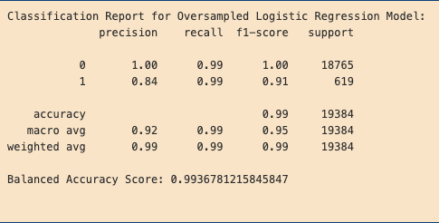

# credit-risk-classification
(Data analytics bootcamp assignment for applying supervised machine learning.)

## Overview

This project aims to build a classification model that can classify potential borrowers as either low-risk or high-risk loans, using supervised machine learning and logistic regression.

The data consists of the following columns:

- The loan principal (loan_size)
- The interest rate (interest_rate)
- The borrower's income (borrower_income)
- The borrower's debt-to-income ratio (debt_to_income)
- The number of accounts the borrower has (num_of_accounts)
- The borrower's derogatory marks, indicating failures to pay back loans as agreed (derogatory_marks)
- The borrower's total debt (total_debt)
- The loan status (loan_status), indicating whether it was a healthy loan (0) or a high-risk loan (1)

## Process

* First, the dataset was divided into features (independent variables) and labels (dependent variables). The dependent variable was the "loan_status" data, while all other columns were designated as independent variables.

* Then, the data was split into training and testing data subsets using the train_test_split module.

* The first logistic regression model was created by fitting the training subsets into the model to train it, and then creating a new set of data by using the X_test data to generate predicted data.

* Then, a balanced accuracy score, confusion matrix, and classification report were created in order to assess the predictive strength of the model.

* A second model was created, this time RandomOverSampler was used to create a more balanced dataset, as the initial model's dataset had a severe imbalance between the number of low-risk and high-risk lenders, which skewed the model's predictive ability.

## Results

#### Initial Logistic Regression Model Results:

The initial model had a reasonably high balanced accuracy score of 95.2%, but it was lacking in its ability to predict high-risk loans, compared to how well it was predicting low-risk loans. When it came to low-risk loans, the model had a precision of 100% and a recall of 99%. But for high-risk loans, the model had a precision of 85% and a recall of 91%.

#### Oversampled Logistic Regression Model Results:

With oversampling, the second version of the model showed improvements over the initial model. The balanced accuracy score improved to 99.4%, and its predictive ability for high-risk loans improved as well. While its precision at finding high-risk borrowers is still comparable, despite degrading to 84%, its recall ability was at 99%, showing that it's gotten better at classifying high-risk borrowers.

## Summary

With this dataset, a model that uses random oversampling would be preferable for delivering accurate classifications of low-risk and high-risk borrowers. When checking the distribution of low-risk and high-risk borrowers in this dataset, there were far more low-risk borrowers (75,036) compared to high-risk borrowers (2,500): a nearly thirty-fold difference. Such an imbalanced and skewed dataset benefitted from using random oversampling in order to balance the data.

Focusing on how well the model identifies potential high-risk borrowers can help banks prevent losses from lending to customers that may not be able to abide by the terms of the loan when it comes to repayment or the timeliness thereof.